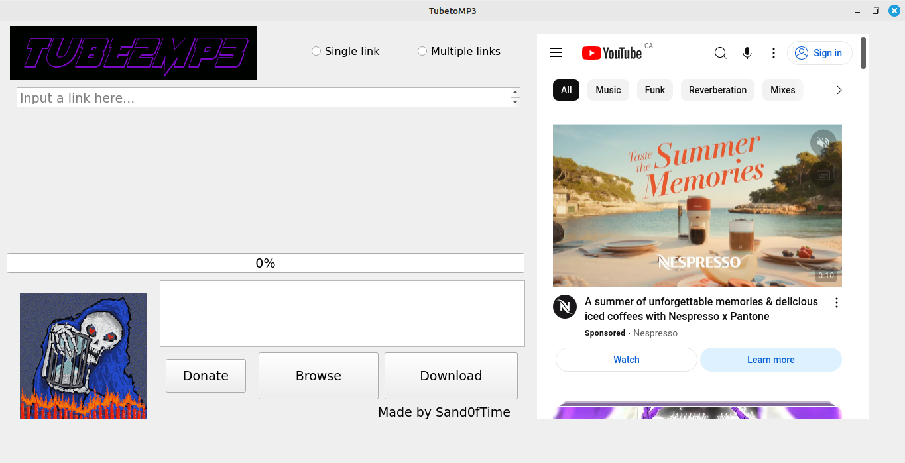
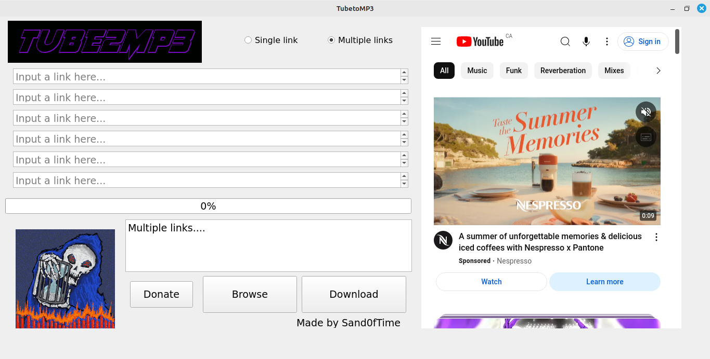
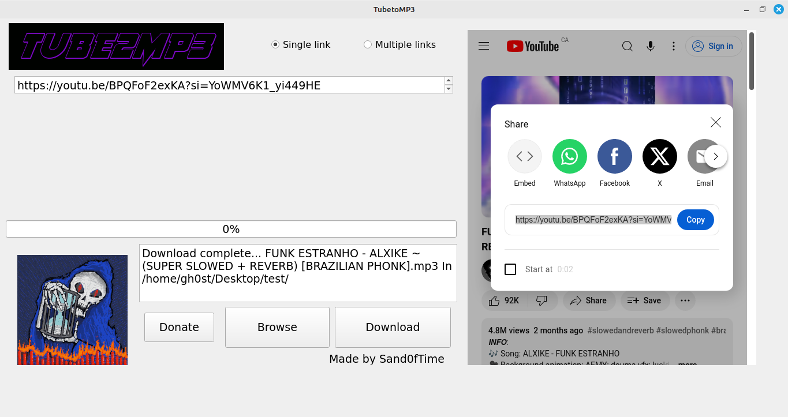

# Tube2MP3

A python software to download MP4 from youtube and converting them to MP3 using youtubedl.

I added some images/gifs to make it look like an oldschool software.

## Images

## Installation
To use the software as is in pycharm or with a terminal you must install the following requirements : 

- FFMPEG 
- PYQT5
- youtubedl
- pyqtwebengine

***COMING SOON************
For simple use download the binary file : 

Linux : check out the dist folder and download the binary, then right-click on it --> properties --> permisions --> allow executing file as program.
***COMING SOON************

Pycharm : 

- Git clone the files in main branch
- Open the project in pycharm and install the requirements using pip install -r requirements.txt or manually type pip install then the name of the requirement.
- Click the play button and try it out!

Using a terminal : 

- Download the projects files as a zip or clone it
- Extract the file and go into the folder where main.py is. 
- Open a terminal in the folder and install the requirements first with pip install **nameoftherequirement** or pip install -r requirements.txt
- Using the same terminal window or right click and open a terminal in the current folder then type **python or python3 ./main.py** to run the program.

## Usage
1. To download songs, first select the option "Single link" or "Multiple link".
2. Click on the "Browse" button and select a directory/folder.
3. Search your song using the youtube webpage on the right and copy the link of the video.
4. Paste the link of the video in the link square.
5. Click download.
6. The GUI will freeze while it's downloading and then you will see the progress bar go to 100 and go back to 0.
7. If everything went well you will see a confirmation in the box.
8. Enjoy!!

## TODO

- [ ] 1. Fix "/" bug that create a new folder when the youtube video has a / in it's name.
- [ ] 2. Make the GIFS works even when downloading a song.
- [ ] 3. Fix the GUI so it can be resized.
- [ ] 4. Make the binary files using pyinstaller.

## Contributing
If you want to contribute to this project DM me https://t.me/sand0ftime and we'll see what we can do.

## Authors and acknowledgment
Check out the artist.txt file for those who made the GIFS & icons.

## License
GNU GPLv3.

## Project status
In progress!
